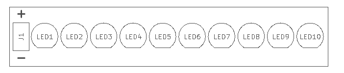
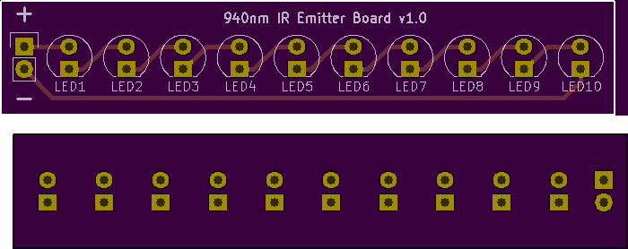

<!--- start title --->
# McPhail IR Emitter Board v1.0
Part of the McPhail Trap design

- Updated: 14 Aug 2017

- Author: Jenner Hanni
- Website: http://wickerbox.net
- Company: Wickerbox Electronics
- License: CERN Open Hardware License v1.2
<!--- end title --->

<!--- bom start --->
### Bill of Materials

|Ref|Qty|Description|Digikey PN|
|---|---|-----------|------|
|J1|1|HEADER MALE 2POS TH 1x02 0.1IN|952-2262-ND|

|Ref|Qty|Description|Mouser PN|
|---|---|-----------|------|
|LED1 LED10 LED2 LED3 LED4 LED5 LED6 LED7 LED8 LED9|10|LED IR 850NM TH SFH4356|720-SFH4356|

<!--- bom end --->
<!--- assy start --->
<!--- assy end --->

