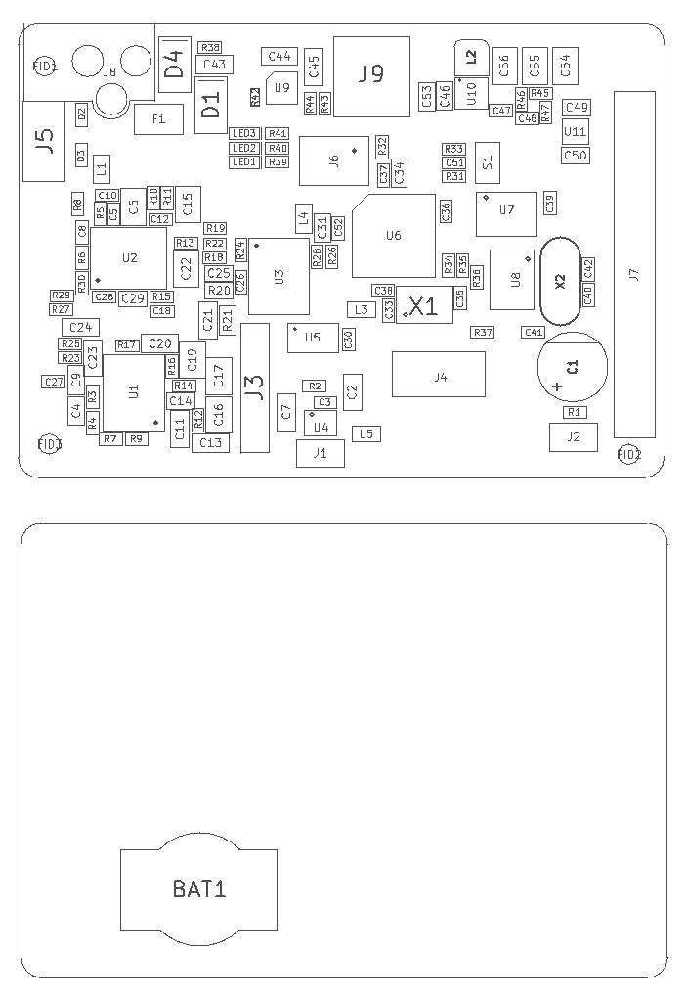
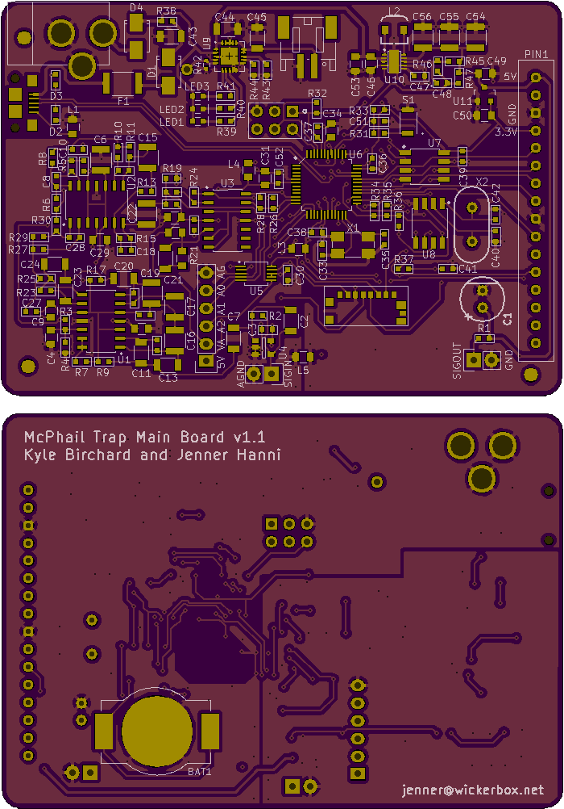

<!--- start title --->
# McPhail Trap Main Board v1.0
Collect, analyze, and report back environmental data.

- Updated: 25 Jul 2017
- Author: Jenner Hanni
- Website: http://wickerbox.net
- Company: Wickerbox Electronics
- License: CERN Open Hardware License v1.2
<!--- end title --->

This is an attempt to reproduce the work of identifying fruit flies from the following papers:

- 2017: [Automated Surveillance of Fruit Flies](http://www.mdpi.com/1424-8220/17/1/110/pdf)
- 2015: [Insect Biometrics: Optoacoustic Signal Processing and its Applications to Remote Monitoring](http://www.ncbi.nlm.nih.gov/pmc/articles/PMC4636391/)
- 2014: [The Electronic McPhail Trap](http://www.mdpi.com/1424-8220/14/12/22285) 
- 1979: [Optical Tachometer for Measurement of Wingbeat Frequency of Free-Flying Insects](http://jeb.biologists.org/content/82/1/377)

Parallels the European [ENTOMATIC](https://www.upf.edu/web/entomatic/) project.

## Hardware Version Notes

- v1.x, proof of concept, collect data on SD card and over USB
  Fona breakout board supports texting
- v2.x, switch to ARM MSP430 or other ADC-specific chip, collect data on SD card
- v3.x, integrate mesh net or other networking, possibly more sophisticated offboard analysis

\pagebreak

## Design Notes

### Physical Housing

Putting the electronics in acrylic separate from the insects so the ultrasonic isn't bothering them. An acrylic housing placed on top of the trap provides protection from the elements as well as protects the insects from any electronics noise. 

If all circuitry is on the board at the top, the IR emitters and photodiode detectors can be the only items in the trap with the insects and be connected by a minimum of cabling. 

### Security and Connectivity Platforms for reference

- Particle
- Electric Imp

### v1 FONA808 GSM+GPS MODULE

- PS is power status. Check this after toggling KEY.
   Pin is low when module is off, and high when module is on.

- NS is network status. It pulses to signal current module status

- RST is hard reset to be used only when module is really stuck.

- RX/TX are pins capable of Software Serial. They are auto-baud so
   whatever baud you send "AT" after reset or boot is the baud rate
   the module will use. 

- RTS is hardware flow control. Optional.
   Turn it on in module if you want to use it. 

- RI is the ring indicator output. Use it as an interrupt. Default high.
   Pin will pulse low for 120ms when a call or SMS is received. 

The GPS is accessible on the Rx/Tx lines so you can query
using AT commands and get the values back. No additional
pins are necessary.

### Microcontroller

Atmel AVR chips aren't going to have the ADC resolution we want.

The paper calls for a 14-bit ADC. Probably best to just switch to the MSP432 or a similar chip, could pick up a $14 dev board as well. This is a TI chip that requires CodeComposer Studio, newest version is CCSv6. It's Linux-compatible and I have a Windows machine just in case it's not.

Need to go over the timing -- seems like my back-of-envelope has 32ms, not 16ms as from their paper.

We may need need a 4-layer board, which doubles board cost. It's unclear if these guys are actually getting and using all 14 bits. Turning off everything but the ADC when sampling.

[Discussion of cheap 16-bit ADC](http://www.avrfreaks.net/forum/cheap-16-bit-adc)

### RTC

The DS1307 real time clock is out of date, replaced it with a MCP7940N. Needs some adjustment to the circuitry and crystal to minimize ppm (frequency tolerance) to minimize time slipping, which could be up to a few minutes per month in the worst case. 

TODO: quantify this deviation, discuss mitigation

### Temperature

TODO: find out how hot a plastic bottle hanging in the sun in Arizona in August could get.

### Capacitors

Mostly ceramic capacitors were chosen for cost and size, with C0G/NP0 and X7R temperature coefficients. Aluminum electrolytic capacitors were chosen where ceramics were cost-prohibitive or where specifically indicated in datasheets.

The temperature coefficients: 

X7R means a capacitor is a temperature-stable (EIA Class 2) cap which only varies up to ±15% from -55°C to +125°C.  [ref](http://www.avx.com/products/ceramic-capacitors/surface-mount/x7r-dielectric/)

C0G/NP0 means a capacitor is temperature-compensating (EIA Class 1) which varies less than ±0.3% C from -55°C to +125°C. Capacitance drift or hysteresis is less than ±0.05%. [ref](http://www.avx.com/products/ceramic-capacitors/surface-mount/c0g-np0-dielectric/)

## Detector/Receiver Board

Interestingly, the receiver part number [TEMD5080X01](https://www.digikey.com/product-detail/en/vishay-semiconductor-opto-division/TEMD5080X01/TEMD5080X01CT-ND/2747443?WT.srch=1&gclid=EAIaIQobChMI-f3J4Zml1QIV6wrTCh2xegkZEAAYAiAAEgK2kvD_BwE) does not have the same package as in the photos of the McPhail trap. These are $1.31 each at 25 and the design calls for ten of them. 

They are good from -40C to 100C and are 5mm x 4.24mm. Ten of them would require a board about 3 inches long and about half an inch wide, or about $7 for a set of three from OSH Park.

This is a $20 board. The stencil costs $5 from OSH Stencils.

## Emitter Board

Emitters are in the $2 range and the board will probably be the same size as the detector board. 

The diffuser needs more investigation.

This is also likely a $20 board. The stencil costs $5 from OSH Stencils.

\pagebreak

<!--- assy start --->
## Main Board Assembly Information

The following layout is only to get a rough idea of how much area the parts would require if they were all on one side of one board. The area is 3 inches x 3 inches, or 9 square inches, and a set of three bare boards would cost $48.20 for three with a manufacturing turnaround of about ten days.

Rough cost of parts for a single board is about $50. 

The stencil from OSH Stencils costs $16.90. A tube of solder paste in the same package costs $14. 

Stencils are 3mil-thick polyamide (orange) film which is reusable.

Total cost for one complete stack of three boards: $129

Assembling a further one complete stack of three boards: $93

|Item|Cost|
|----|----|
|Emitter Board PCB|$3|
|Emitter Parts|$13|
|Emitter Stencil|$5|
|Detector Board PCB|$3|
|Detector Parts|$13|
|Detector Stencil|$5|
|Main Board PCB|$16|
|Main Board Parts|$45|
|Main Board Stencil|$17|
|Leaded Solder|$14|

<!--- assy end --->

\pagebreak

<!--- bom start --->
## Bill of Materials

|Ref|Qty|Description|Digikey PN|
|---|---|-----------|------|
|BAT1|1|CR1220 BATTERY HOLDER SMT FLATPIN|BK-916-CT-ND|
|C1|1|CAP ALUM 330UF 20% 16V RADIAL|732-8798-1-ND|
|C10 C3|2|CAP CER 0.27UF 16V X7R 0603|490-6427-1-ND|
|C11 C13 C2 C7|4|CAP CER 1.5UF 25V X7R 1206|1276-6873-1-ND|
|C12 C28 C8|3|CAP CER 0.01UF 50V X7R 0603|490-1512-1-ND|
|C14 C29 C34 C4 C49 C50 C9|7|CAP CER 1UF 25V X7R 0805|1276-1066-1-ND|
|C15 C6|2|CAP CER 22UF 25V X7R 1210|1276-3392-1-ND|
|C16 C17 C19 C22|4|CAP CER 2.2UF 25V X7R 0805|1276-2953-1-ND|
|C18|1|CAP CER 33PF 16V X7R 0603|478-6211-1-ND|
|C20 C21 C23 C24 C43-C46|8|CAP CER 4.7UF 50V X7R 1206|587-2994-1-ND|
|C25|1|CAP CER 10UF 16V X7R 0805|1276-2872-1-ND|
|C26 C30-C32 C36-C39 C47|9|CAP CER 0.1UF 100V X7R 0603|490-3285-1-ND|
|C27|1|CAP CER 0.022UF 50V X7R 0603|1276-2004-1-ND|
|C33 C35|2|CAP CER 22pF 50V NP0 0603|399-9031-1-ND|
|C40 C42|2|CAP CER 2PF 50V C0G/NP0 0603|490-10713-1-ND|
|C41|1|CAP CER 100PF 50V C0G/NP0 0603|490-1427-1-ND|
|C48|1|CAP CER 10PF 50V NP0 0603|1276-2154-1-ND|
|C5|1|CAP CER 0.039UF 50V X7R 0603|1276-2056-1-ND|
|D1 D4|2|DIODE SCHOTTKY 20V 1A SMA|SS12-E3/61TGICT-ND|
|D2 D3|2|VARISTOR ESD PROTECT USB|CG0603MLC-05ECT-ND|
|F1|1|RESETTABLE FUSE 500mA 15V MF-MSMF|MF-MSMF050-2CT-ND|
|J1 J2|2|HEADER MALE 2POS TH 1x02 0.1IN|952-2262-ND|
|J3|1|HEADER MALE 6POS KK100 0.1IN SHROUD TH|WM4204-ND |
|J4|1|CONN MICRO SD CARD PUSH-PULL|WM9731CT-ND|
|J5|1|USB MICRO-B RECEPTACLE 5PIN SMT|609-4616-1-ND|
|J6|1|HEADER MALE 6POS 2x3 0.1IN|952-1921-ND|
|J8|1|CONN PWR JACK 2.5X5.5MM HIGH CUR|PJ-202BH|
|J9|1|CONN HEADER PH SIDE 2POS 2MM|455-1719-ND|
|L1|1|FERRITE BEAD 220 OHM 0402 1LN|240-2554-1-ND|
|LED1 LED2 LED3|3|LED AMBER DIFFUSED 0603 SMD|475-2712-1-ND|
|R1|1|RES SMD 220 OHM 5% 1/10W 0603|311-220GRCT-ND|
|R10|1|RES SMD 732 OHM 1% 1/10W 0603|P732HCT-ND|
|R11 R8|2|RES SMD 1.43K OHM 1% 1/10W 0603|P1.43KHCT-ND|
|R12 R16 R23|3|RES SMD 2.26K OHM 1% 1/10W 0603|311-2.26KHRCT-ND|
|R13 R33 R36|3|RES SMD 10K OHM 1% 1/8W 0603|RNCP0603FTD10K0CT-ND|
|R14 R39 R40 R41|4|RES SMD 470 OHM 5% 1/4W 0603|RHM470DCT-ND|
|R15|1|RES SMD 97.6K OHM 1% 1/10W 0603|P97.6KHCT-ND|
|R17|1|RES SMD 68 OHM 1% 1/10W 0603|P68.0HCT-ND|
|R18 R19|2|RES SMD 91K OHM 1% 1/10W 0603|P91.0KHCT-ND|
|R2|1|RES SMD 64.9K OHM 1% 1/10W 0603|P64.9KHCT-ND|
|R20 R21|2|RES SMD 220K OHM 5% 1/8W 0805|P220KACT-ND|
|R22 R26|2|RES SMD 2.2K OHM 5% 1/10W 0603|P2.2KGCT-ND|
|R24 R28|2|RES SMD 22K OHM 5% 1/10W 0603|P22KGCT-ND|
|R25 R29|2|RES SMD 4.32K OHM 1% 1/10W 0603|P4.32KHCT-ND|
|R27|1|RES SMD 2.94K OHM 1% 1/10W 0603|P2.94KHCT-ND|
|R3 R4 R44|3|RES SMD 100K OHM 1% 1/10W 0603|RMCF0603FG100KCT-ND|
|R30 R6|2|RES SMD 3.83K OHM 1% 1/10W 0603|P3.83KHCT-ND|
|R31 R32|2|RES 22 OHM 5% 1/10W 0603|311-22GRCT-ND|
|R34 R35 R43|3|RES SMD 2K OHM 1% 1/8W 0603|RNCP0603FTD2K00CT-ND|
|R37|1|RES SMD 1K OHM 1% 1/10W 0603|1276-3484-1-ND|
|R38|1|RES SMD 0.0 OHM JUMPER 1/8W 0603|MCT0603-0.0-ZZCT-ND|
|R42|1|NTC THERMISTOR 10K OHM 1% 0402|445-2550-1-ND|
|R45 R47|2|RES SMD 1M OHM 5% 1/10W 0603|P1.0MGCT-ND|
|R46|1|RES SMD 111K OHM 5% 1/10W 0603|P110GCT-ND|
|R5|1|RES SMD 1.87K OHM 1% 1/10W 0603|P1.87KHCT-ND|
|R7|1|RES SMD 10 OHM 1% 1/10W 0603|P10.0HCT-ND|
|R9|1|RES SMD 470 OHM 5% 1/4W 0603|311-1.02KHRCT-ND|
|S1|1|SWITCH TACTILE SPST-NO 0.05A 12V|SW1020CT-ND|
|U1 U2 U4|3|IC OPAMP QUAD GP RRO 1MHZ SOIC14|MCP6004T-I/SLCT-ND|
|U10|1|IC REG BUCK BOOST ADJ 2A 10WSON|296-30204-1-ND|
|U11|1|IC REG LDO 3.3V 0.25A MCP1703 SOT23A-3|MCP1703T-3302E/CBCT-ND|
|U3|1|IC OPAMP GP 3MHZ RRO 14SOIC|296-39258-1-ND|
|U5|1|IC VOLT-LEVEL TRANSLATOR TXB0104 SOIC14|296-21928-1-ND|
|U6|1|MCU 8BIT ATMEGA32U4 44TQFP|ATMEGA32U4RC-AU-ND|
|U7|1|IC EEPROM 1MBIT 400KHZ 24AA1025 SOIC8|24AA1025-I/SN-ND|
|U8|1|IC RTC CLK/CALENDAR I2C MCP7940N SOIC8|MCP7940N-E/SN-ND|
|U9|1|IC USB/AC BATT CHRGR MCP73871 20QFN|MCP73871T-2CCI/MLCT-ND|
|X1|1|CRYSTAL 16MHZ 30PPM 18pF 4SMD|CTX1206CT-ND|
|X2|1|CRYSTAL 32.768kHz 7pF CFS-20632768DZYB|300-8842-ND|

|Ref|Qty|Description|Adafruit PN|
|---|---|-----------|------|
|B1|1|Lithium Ion Polymer Battery - 3.7v 500mAh|1578|
|J7|1|ADAFRUIT FONA 808 + GPS|2542|

|Ref|Qty|Description|Mouser PN|
|---|---|-----------|------|
|L2|1|FIXED IND 1UH 11A XFL4020-102|994-XFL4020-102MEC|

<!--- bom end --->

