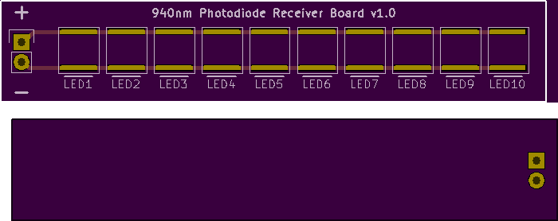

<!--- start title --->
# McPhail IR Detector Board v1.0
Part of the McPhail Trap Design

Updated: 6 Aug 2017

- Author: Jenner Hanni
- Website: http://wickerbox.net
- Company: Wickerbox Electronics
- License: CERN Open Hardware License v1.2
<!--- end title --->

<!--- bom start --->
### Bill of Materials

|Ref|Qty|Description|Digikey PN|
|---|---|-----------|------|
|J1|1|HEADER MALE 2POS TH 1x02 0.1IN|952-2262-ND|
|LED1-10|10|PHOTODIODE IR 940NM SMD TEMD5110X01|751-1048-1-ND|

<!--- bom end --->
<!--- assy start --->

<!--- assy end --->

